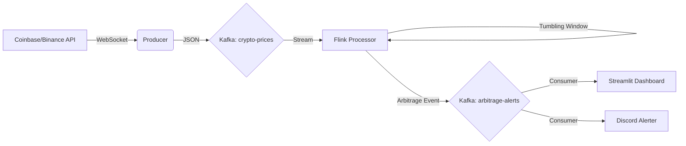
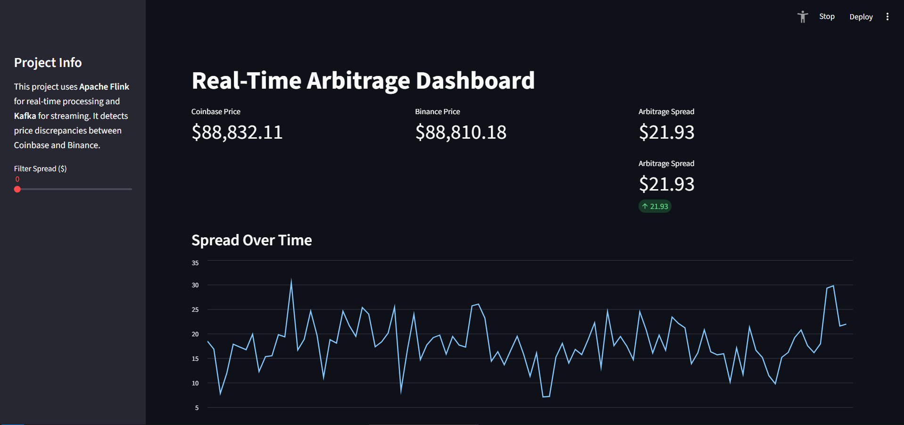
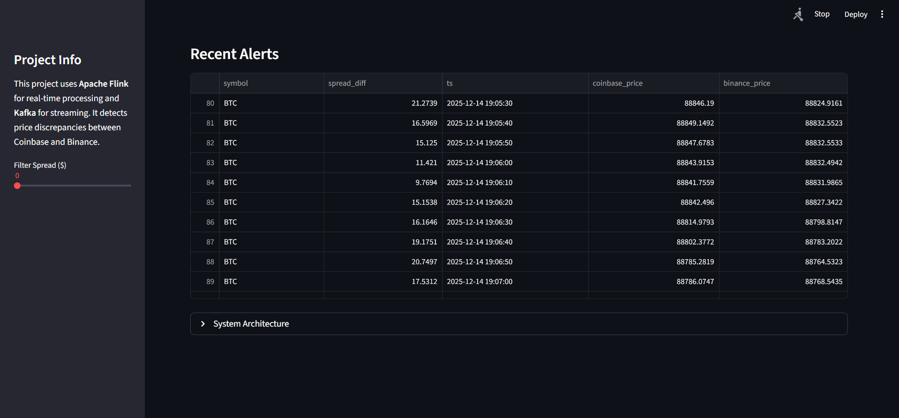

#  Real-Time Crypto Arbitrage Detector
A robust, real-time data engineering pipeline that detects Bitcoin (BTC) price discrepancies between Coinbase and Binance using Apache Flink and Kafka. The system processes market data in real-time, identifies arbitrage opportunities, and alerts users via Discord and a live Streamlit dashboard.

## Architecture
The pipeline consists of four main microservices orchestrated via Docker Compose:



**Consumer/Producer (`src/producer.py`):**
- Connects to Coinbase and Binance WebSockets.
- Normalizes real-time trade data.
- Publishes to Kafka topic `crypto-prices`.

**Stream Processor (`src/processor.py`):**
- Apache Flink (PyFlink) job.
- Consumes from `crypto-prices`.
- Applies Tumbling Windows (10 seconds) to aggregate prices.
- Joins streams from both exchanges.
- Detects spreads > $50.
- Sinks alerts to Kafka topic `arbitrage-alerts`.

**Alerter Service (`src/alerter.py`):**
- Consumes from `arbitrage-alerts`.
- Sends real-time notifications to a Discord Webhook.

**Dashboard (`src/dashboard.py`):**
- Streamlit application.
- Consumes `arbitrage-alerts` to visualize price spreads and alert history in real-time.

## 📸 Screenshots
### Live Dashboard
Real-Time Alerts Real-time visualization of price spreads Instant notifications sent to Discord


##  Quick Start

### 1. Prerequisites
- Docker & Docker Compose installed.
- Git installed.

### 2. Setup Project Structure
Clone the repository and ensure your workspace looks like this:
```text
.
├── docker-compose.yml
├── Dockerfile
├── jars/
│   └── flink-sql-connector-kafka-3.0.1-1.18.jar  <-- See download link below
└── src/
    ├── producer.py
    ├── processor.py
    ├── alerter.py
    └── dashboard.py
```

### 📥 Download Required JAR:
You must download the Flink-Kafka connector and place it in the `jars/` folder:
Download flink-sql-connector-kafka-3.0.1-1.18.jar

### 3. Configuration (Critical)
Before running, you must configure where the alerts are sent.
1. Open `src/alerter.py`.
2. Find the variable `DISCORD_WEBHOOK`.
3. Replace the placeholder text with your actual Discord Webhook URL.
   - If you don't have one, you can leave it blank, but you won't receive Discord notifications.

### 4. Run the System
Build the custom images and start the services:
```bash
docker-compose up --build -d
```

### 5. Verify Output
- **Dashboard:** Access the real-time graph at http://localhost:8501
- **Logs:** Watch the "Brain" (Flink) processing data:
```bash
docker-compose logs -f taskmanager
```

## ⚙️ Configuration & Demo Mode
### Demo Mode
Real arbitrage opportunities are rare. To force alerts for testing purposes, you can enable `DEMO_MODE`. This lowers the detection threshold to $0.1.

1. Open `docker-compose.yml`.
2. Find the `job-submitter` service.
3. Add/Uncomment the environment variable:
```yaml
job-submitter:
  environment:
    - DEMO_MODE=TRUE
```
Restart the services: `docker-compose up -d`

## 📂 Project Structure
| File/Folder | Description |
|---|---|
| `src/producer.py` | Python script to fetch WS data and push to Kafka. |
| `src/processor.py` | PyFlink SQL job for windowing and arbitrage logic. |
| `src/alerter.py` | Service to push alerts to Discord. |
| `src/dashboard.py` | Streamlit web app for visualization. |
| `docker-compose.yml` | Orchestrates Zookeeper, Kafka, JobManager, TaskManager, and App services. |
| `Dockerfile` | Custom image definition for Python dependencies. |

## 🛠️ Troubleshooting
- **"Leader Not Available" in Kafka Logs:**
  This is common during startup. The services are designed to retry and should recover automatically after 30-60 seconds.
- **Dashboard shows "Waiting for Kafka":**
  Ensure the Kafka container is healthy (`docker ps`).
- **No Alerts:**
  Real arbitrage is rare! Enable `DEMO_MODE` to verify the pipeline is working.
